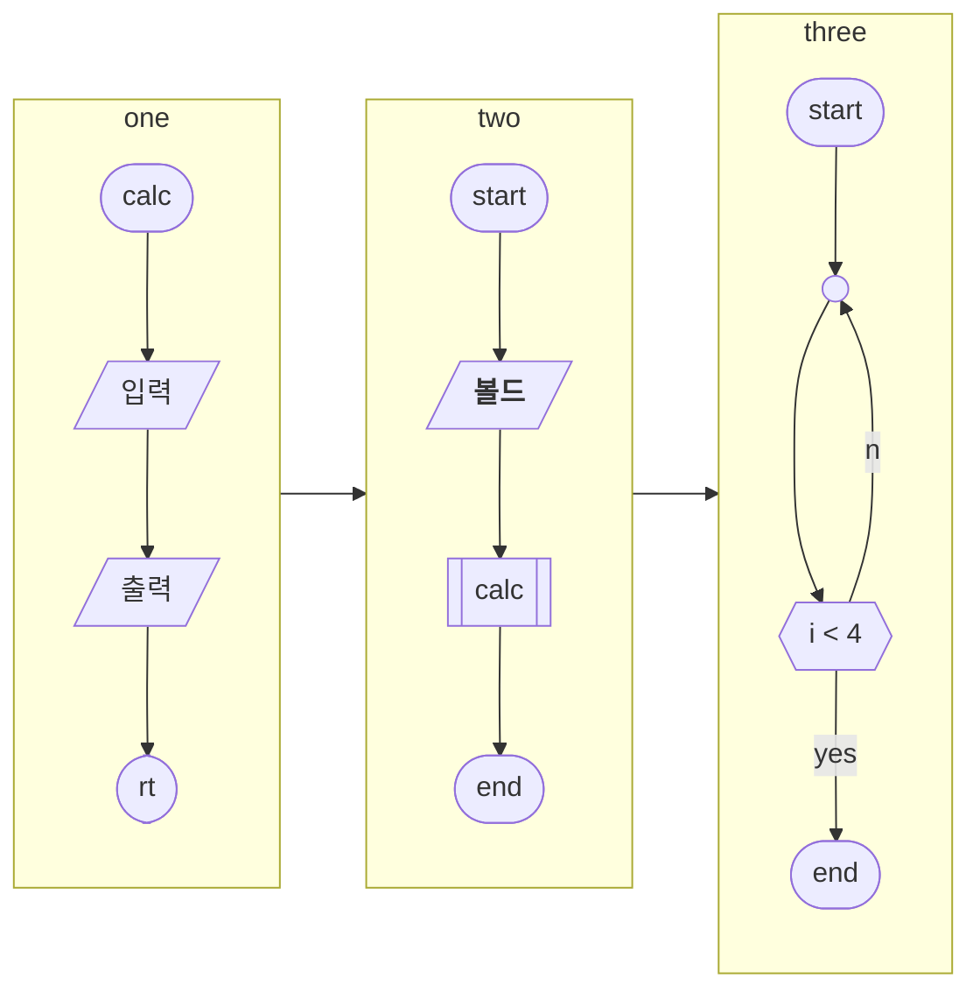

# docsTest

```mermaid
flowchart LR
    subgraph one
        calc([calc])
        calc --> inp[/입력/]
        inp --> out[/출력/]
        out --> rt([rt])
    end

    subgraph two
        start([start]) --> inp1[/"`**볼드**`"/]
        inp1 --> fun1[[calc]]
        fun1 --> end1([end])
    end

    subgraph three
        start1([start]) --> blank(( ))
        blank --> cond{{i < 4}}
        cond --no--> blank
        cond --yes--> end2([end])
    end

    one --> two --> three
```